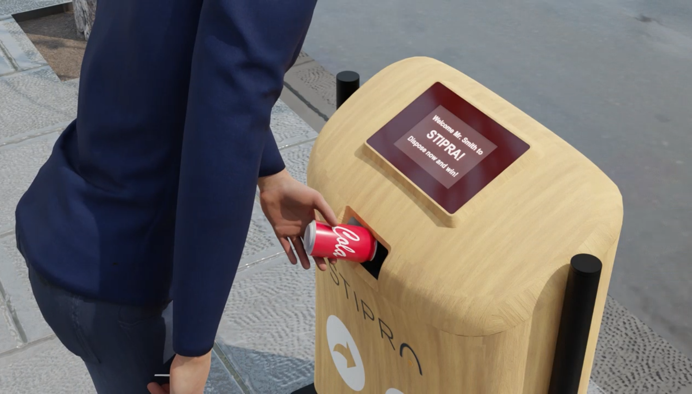

# POD - Point of Disposal  
**A Smart Bin for Real Consumption Data**  created by [TeknTrash Robotics](https://www.tekntrash.com)

---

## 🔍 What is POD?

POD (Point of Disposal) is a smart bin developed by TeknTrash Robotics that captures *actual consumption data*—not just sales. While Point of Sale (POS) systems tell you what was purchased, POD reveals what was truly consumed by analyzing what ends up in the trash.

This distinction is critical:  
> Over **80%** of the ~30,000 new products launched each year in the U.S. fail—largely because brands lack insights into post-sale product engagement.

---

## 🧠 Why Consumption Data Matters

Unlike sales data, consumption data enables powerful new insights, including:

1. **Consumption Lag Analysis**  
   Track the time between purchase and disposal to understand usage speed.

2. **Geo-Consumption Matching**  
   Compare purchase location with disposal location to validate marketing strategies.

3. **Churn Detection**  
   Identify users who stop disposing specific products and take action.

4. **Campaign Monitoring**  
   Measure the impact of advertising in real time based on regional usage.

---

## 🗑️ How POD Works

POD is not just a bin—it’s a **smart device** that:

- **Scans Barcodes** using a Datalogic reader  
- **Identifies Objects** by shape with a ZED depth camera  
- **Measures Weight and Temperature** to assess consumption level  
- **Sorts Waste** into two internal bins (monitored vs. unmonitored products)
- Uses a **touchscreen display** for user prompts and interaction
- **Recognizes Users** via NFC card  
- **Connects to the Cloud** to retrieve user and product monitoring data  
- **Speaks to the User**, offering rewards and feedback (via USB audio)

For example, if a product is disposed of mostly full, it might signal dissatisfaction. POD captures this type of actionable insight in real time.

---

## 🎁 Rewarding Consumers

POD supports reward systems by integrating with [ProduTrak](https://www.produtrak.com), a data platform that:

- Aggregates consumption data from multiple PODs and recycling plant robots  
- Closes the loop in product lifecycle analysis  
- Enables FMCG brands to reward eco-conscious consumer behavior  

---

## 🎬 Demo Video

Watch a full demo of POD in action here:  
👉 [POD.mp4 on GitHub](https://github.com/tekntrash/POD/blob/main/POD.mp4)

---

## 🧰 Hardware Requirements

The POD system is designed to work with:

- Datalogic Barcode Reader 3550HSi
- ZED Depth Camera 
- Robotic Arm Dobot V1
- Generic NFC Card Reader  
- Generic USB Audio Output Device  
- Touchscreen Waveshare 8DP-CAPLCD
---

## 🎬 Demo

A detailed video showcasing POD’s functionality is included in this repository.  

---

## 💾 About This Repo

This repository contains the **first release** of the POD software. We are open-sourcing it because it includes useful components for learning:
- Barcode identification  
- Robotic control  
- NFC card reading  
- Text-to-speech integration  
- Consumption analytics logic
- Touchscreen reading

---

## 🧪 Get Involved

We welcome contributions, feedback, and ideas to improve POD. If you're interested in using POD in your smart city, waste management, or FMCG data initiatives send an email to info@tekntrash.com

---

## 📜 License

This project is released under the MIT License. See [LICENSE](https://github.com/tekntrash/POD/blob/main/LICENSE) for details.

---

## 💾 Installation

See [install.md](install.md) for complete setup instructions.
